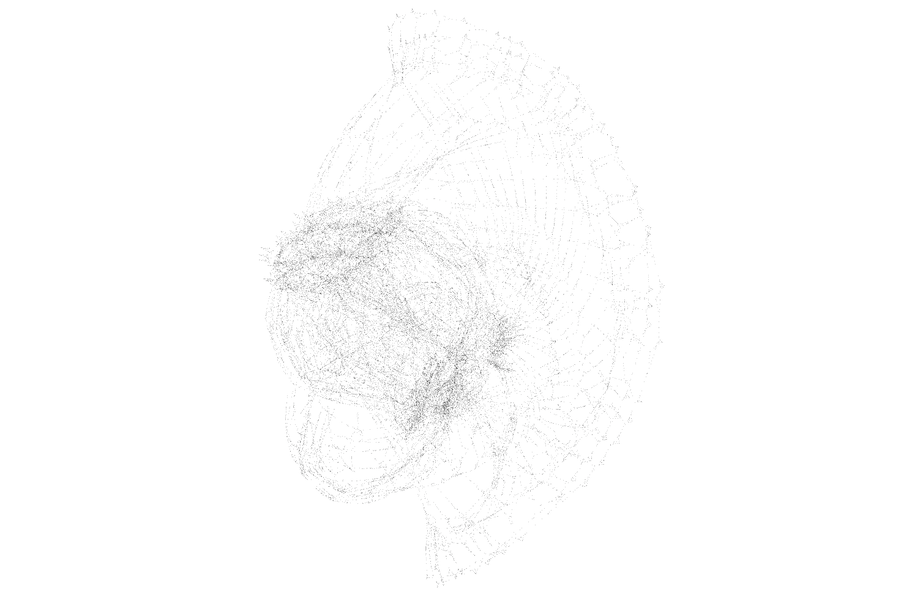
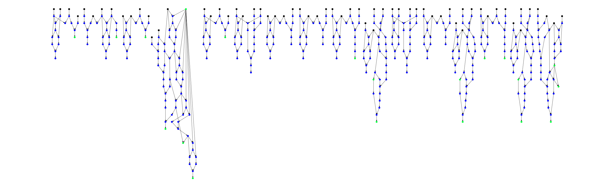
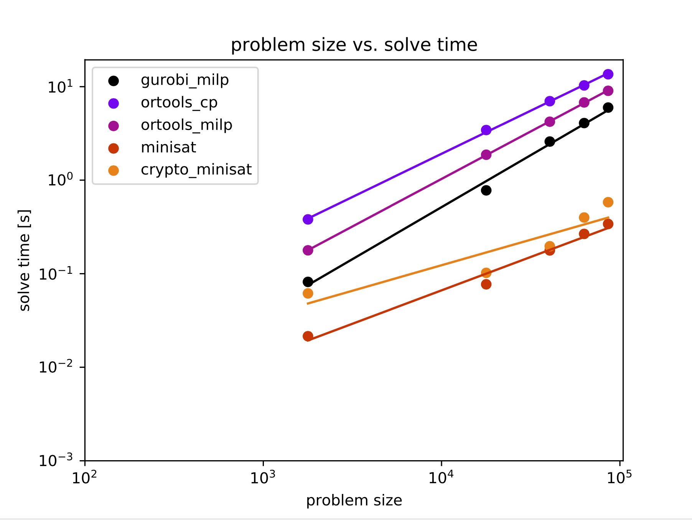
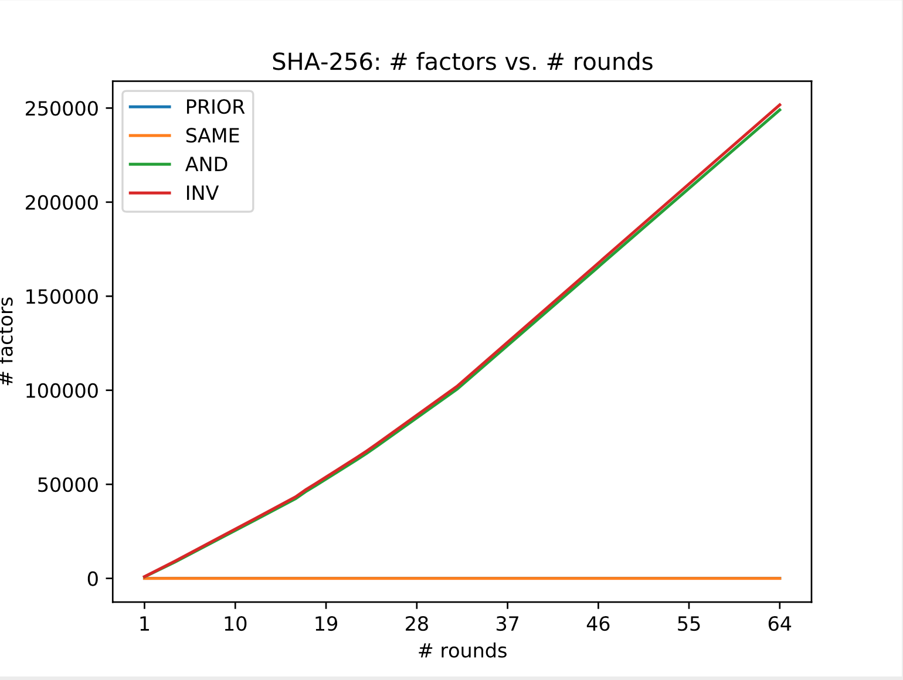

Bit relationships after 4-round SHA-256. 17806 nodes, 26383 edges.


Lossy "pseudo-hash" used to validate solver accuracy, showing relationship between input and output bits.

# Contents

- [Description](#description)
- [Installation](#installation)
	- [Python](#python)
	- [C++](#c)
- [Quickstart](#quickstart)
	- [Writing your own hash function](#writing-your-own-hash-function)
- [How it works](#how-it-works)
	- [Dataset generation](#dataset-generation)
	- [Dataset format](#dataset-format)
- [Solving Methods](#solving-methods)
	- [SAT Solvers](#sat-solver)
	- [MILP](#milp)
	- [Optimization](#optimization)
	- [Belief Propagation](#belief-propagation)
	- [Machine Learning](#machine-learning)
- [References and Resources](#references-and-resources)

# Description

This repository contains Python and C++ code which attempts to reverse one-way cryptographic hash functions, with specific focus on [SHA-256](https://en.bitcoinwiki.org/wiki/SHA-256). A hash function `f` can be thought of as an operation on bits `X` to produce output bits `Y`: `f(X) = Y`. Given knowledge of `Y` and how `f` works, we want to find some bits `X'` such that `f(X') = Y`. This is commonly known as a [preimage attack](https://en.wikipedia.org/wiki/Preimage_attack). Note that `X` does not necessarily need to equal `X'`.

A successful preimage attack has serious implications for basically the entire Internet, financial community, and national defense of major governments. Hash functions are used in all kinds of domains: from BitCoin mining and transactions, to HTTPS encryption, to storage of user passwords in server databases.

I've spent a long time (too long!) trying to solve this "impossible" problem using a variety of methods, detailed below. As a **disclaimer**: I do not claim that any of these methods break the security of the full 64-round SHA-256 hash function. It's probably still infeasible. Prove me wrong :)

# Installation

It is not necessary to install everything listed here. If you just want to run certain parts of the code (e.g. C++ vs. Python) you can skip some steps. I developed everything on a Mac, so most things will translate well to Linux but maybe not to Windows.

### Python
Use Python 3.6 with [Anaconda](https://docs.anaconda.com/anaconda/install/). Start by creating and activating a new environment:

```
conda create -n preimage python=3.6
conda activate preimage
python --version  # Should show 3.6
```

Install project dependencies:

```
pip install -r requirements.txt
```

Not all of the solving methods will work out-of-the-box from here. If you want certain solvers, you will need to install them individually:

- [Gurobi](https://www.gurobi.com/)
- [Cplex](https://www.ibm.com/analytics/cplex-optimizer)
- [MiniSat](http://minisat.se/)
- [CryptoMiniSat](https://www.msoos.org/cryptominisat5)

For Cplex on Mac OS X, make sure to do:

```
export PYTHONPATH=/Applications/CPLEX_Studio1210/cplex/python/3.6/x86-64_osx
```

### C++

You need to install [cmake](https://cmake.org/install/) and [`cpp-yaml`](https://github.com/jbeder/yaml-cpp). Then to compile the code in this repository, nagivate to the [`belief_propagation`](./belief_propagation) directory and run:

```
$ ./kompile
```

# Quickstart

Generate datasets:

```
$ ./generate_all_hashes.sh
```

Choose a dataset:

```
$ ls -la ./data
drwxr-xr-x  27 trevphil  staff  864 Nov  3 23:04 .
drwxr-xr-x  15 trevphil  staff  480 Nov 22 12:29 ..
drwxr-xr-x  11 trevphil  staff  352 Nov  3 22:54 addConst_d1
drwxr-xr-x  11 trevphil  staff  352 Nov  3 22:53 add_d1
drwxr-xr-x  11 trevphil  staff  352 Nov  3 22:54 andConst_d1
drwxr-xr-x  10 trevphil  staff  320 Nov  3 22:54 sha256_d1
...
```

The "d1" at the end means that the difficulty level is "1". The full SHA-256 algorithm uses a difficulty of 64 (because it has 64 rounds). Run a solver on the dataset of your choice:

```
$ python -m optimization.main data/addConst_d1 --solver ortools_cp
```

To see the available solvers and usage of the tool:

```
$ python -m optimization.main --help
usage: main.py [-h]
               [--solver {gradient,gnc,cplex_milp,cplex_cp,ortools_cp,ortools_milp,gurobi_milp,minisat,crypto_minisat}]
               dataset

Hash reversal via optimization

positional arguments:
  dataset               Path to the dataset directory

optional arguments:
  -h, --help            Show this help message and exit
  --solver {gradient,gnc,cplex_milp,cplex_cp,ortools_cp,ortools_milp,gurobi_milp,minisat,crypto_minisat}
                        The solving technique
```

### Writing your own hash function

Take a look at the existing hash functions in [`dataset_generation/hash_funcs.py`](./dataset_generation/hash_funcs.py). For example, this function simply adds a constant value to the input:

```
class AddConst(SymbolicHash):
    def hash(self, hash_input: SymBitVec, difficulty: int):
        n = len(hash_input)
        A = SymBitVec(0x4F65D4D99B70EF1B, size=n)
        return hash_input + A
```

Implement your own hash function class which inherits from `SymbolicHash` and has the function `hash(...)`, and add your class to the dictionary returned by the function `hash_algorithms()` in [`dataset_generation/hash_funcs.py`](./dataset_generation/hash_funcs.py). The following operations are supported for primitives ([`SymBitVec`](./dataset_generation/sym_bit_vec.py) objects) in the hash function:

- AND: `C = A & B`
- OR: `C = A | B`
- XOR: `C = A ^ B`
- NOT (aka INV for "inverse"): `B = ~A`
- Addition: `C = A + B`
	- `A`, `B`, and `C` should have the same number of bits, overflow is ignored
- Shift left: `B = (A << n)`
	- `B` will have the same number of bits as `A`
- Shift right: `B = (A >> n)`
	- `B` will have the same number of bits as `A`

To generate a dataset using your hash function, run a command like the following:

```
$ python -m dataset_generation.generate --num-samples 64 --num-input-bits 64 --hash-algo my_custom_hash --visualize --difficulty 4
```

The dataset is explained more in-depth below. To see the usage of the dataset generation tool, run:

```
python -m dataset_generation.generate --help
usage: generate.py [-h] [--data-dir DATA_DIR] [--num-samples NUM_SAMPLES]
                   [--num-input-bits NUM_INPUT_BITS]
                   [--hash-algo {add,addConst,andConst,invert,lossyPseudoHash,nonLossyPseudoHash,orConst,sha256,shiftLeft,shiftRight,xorConst}]
                   [--difficulty DIFFICULTY] [--visualize]
                   [--hash-input HASH_INPUT] [--pct-val PCT_VAL]
                   [--pct-test PCT_TEST]

Hash reversal dataset generator

optional arguments:
  -h, --help            Show this help message and exit
  --data-dir DATA_DIR   Path to the directory where the dataset should be
                        stored
  --num-samples NUM_SAMPLES
                        Number of samples to use in the dataset
  --num-input-bits NUM_INPUT_BITS
                        Number of bits in each input message to the hash
                        function
  --hash-algo {add,addConst,andConst,invert,lossyPseudoHash,nonLossyPseudoHash,orConst,sha256,shiftLeft,shiftRight,xorConst}
                        Choose the hashing algorithm to apply to the input
                        data
  --difficulty DIFFICULTY
                        SHA-256 difficulty (an interger between 1 and 64
                        inclusive)
  --visualize           Visualize the symbolic graph of bit dependencies
  --hash-input HASH_INPUT
                        Give input message in hex to simply print the hash of
                        the input
  --pct-val PCT_VAL     Percent of samples used for validation dataset
  --pct-test PCT_TEST   Percent of samples used for test dataset
``` 

# How it works

### Dataset generation

The first thing we need in order to approach this problem is to find out how the hash function `f` operates on input bits `X` to produce output bits `Y` without making any assumptions about `X`. To this end, I make the hash functions operate on symbolic bit vectors, i.e. `SymBitVec` objects. These objects track the relationship between input and output bits for all computations in the hash function, e.g. if `C = A & B`, we track the relationship that bit `C` is the result of AND-ing `A` and `B`. Ultimately after all of the computations, we will have the relationship between each bit of `Y` and each bit of `X` in the function `f(X) = Y`.

Some simplifications can be made during this process. For example, let's say that bit `A` is a bit from the unknown input `X` and bit `B` is a _constant_ in the hash algorithm equal to 0. Well then we know that `C = A & 0 = 0` so `C = 0` no matter the value of `A`. Some more simplifications for operations on single bits are listed below:

- `B = A & 1 = A`
- `B = A | 0 = A`
- `B = A | 1 = 1`
- `B = A ^ 1 = ~A`
- `B = A ^ 0 = A`
- `B = A ^ A = 0`
- `B = A & A = A | A = A`

These simplifications help to reduce the size of the symbolic representation of the hash function, since the output bit `B` is sometimes a constant or equal to the unknown input `A`. When this happens, we don't need to introduce a new unknown variable. 

Furthermore, the problem can be made easier to handle by reducing all operations (XOR, OR, addition) to only using AND and INV logic gates. For example, `C = A ^ B` is equivalent to:

```
X = ~(A & B)
Y = ~(A & X)
Z = ~(B & X)
C = ~(Y & Z)
```

This _does_ introduce intermediate variables, but critically, the AND and INV operations can be **linearized** and also represented in the continuous domain, which is important mathematically. Normally in the discrete domain, we would consider each bit as a binary "[random variable](https://en.wikipedia.org/wiki/Random_variable)" taking the value 0 or 1.

The AND operation can be represented with multiplication: `C = A & B = A * B`, and the INV operation with subtraction: `B = ~A = 1 - A`. To linearize the AND operation, we can use [the following method](https://or.stackexchange.com/questions/37/how-to-linearize-the-product-of-two-binary-variables):

```
C = A & B = A * B
Equivalent to:
C <= A
C <= B
C >= A + B - 1
```

Note that no information is lost during the INV operation (we can always recover the input from the output of INV), but there _is_ information lost during AND when the output is 0. When the output is 1, we know that both inputs must have been 1. But when the output is 0, there are three possible inputs: `0 = 0 & 0 = 0 & 1 = 1 & 0`. **Thus, all complexity in reversing a hash function comes from AND gates whose output is 0**.

### Dataset Format

When you create a dataset using the command `python -m dataset_generation.generate [args]`, it will create a sub-directory under `./data` with a name like `hashFunc_dX` where "hashFunc" is the name of the hash function and "X" will be replaced with an integer difficulty level used by the hash function. Within this directory, the following files will be created:

```
hashFunc_dX
├── data.bits
├── factors.cnf
├── factors.txt
├── graph.graphml
├── graph.pdf
├── params.yaml
├── test.hdf5
├── train.hdf5
└── val.hdf5
```

Below is an outline of what each file contains:

- `params.yaml`: Information about the dataset like the name of the hash algorithm, number of input bits `X`, and indices of the hash output bits `Y` with respect to all of the random variable bits tracked in the hash computation
- `data.bits`: This is a binary file. Let's say you chose the options `--num-samples 64 --num-input-bits 128`, then the hash function will execute 64 times, each time with a random 128-bit input to the hash function. Let's say 1 pass of the hash function generates 2000 random variable bits, starting with the hash input bits `X` directly and (generally) ending with the hash output bits `Y`, although the `Y` bits might not be grouped together consecutively at the end. This file will contain 64*2000 bits which result from concatenating 2000 bits 64 times. When I say that a bit has index _i_, it means the _i_-th bit of 2000 bits. **The number of samples should always be a multiple of 8 to avoid filesystem errors** where the file length does not fit into an integer number of bytes.
- `factors.txt`: Encodes the relationship between input and output bits of logic gates. Some examples follow...
	- `PRIOR;10`: The random variable bit with index 10 is a prior, i.e.  a bit from the unknown input `X`
	- `INV;94;93`: The random variable bit with index 94 is a result of the INV operation on bit 93, i.e. `B94 = ~B93`
	- `AND;95;61;29`: Bit 95 is the result of AND-ing bits 61 and 29, i.e. `B95 = B61 & B29`
- `factors.cnf`: An alternative representation of the relationship between random variable bits using [DIMACS Conjunctive Normal Form](https://people.sc.fsu.edu/~jburkardt/data/cnf/cnf.html) (CNF). All logic gates can be converted to this form, see [`factor.py`](./dataset_generation/factor.py). The bit indices in CNF are all +1 relative to their indices in the other representations, so keep that in mind.
- `graph.pdf`: If you specify the optional `--visualize` argument to the dataset generation tool, it will create a visualization of the hash function like the one shown in the beginning of the README. Hash input bits are shown in black, and output bits in green.
- `graph.graphml`: This is another representation of the directed graph in [graphml](http://graphml.graphdrawing.org/) format showing relationships between bits, useful for visualizing in tools like [Gephi](https://gephi.org/)
- `test.hdf5`, `train.hdf5`, `val.hdf5`: These contain the same data as `data.bits` but in [HDF5 format](https://docs.h5py.org/en/stable/) which is convenient for machine learning. The samples from the `--num-samples` option are distributed among train, test, and validation sets.

# Solving Methods

Using the latest and greatest as of November 2020, the solving methods are listed from what I believe to be most effective to least effective. Even the best methods seem to fail on the 17th round of SHA-256 (discussed below).

1. [CryptoMiniSat](https://www.msoos.org/cryptominisat5/): I didn't even take advantage of CryptoMiniSat's optimized treatment of XOR since all operations were reduced to AND and INV logic gates
2. [MiniSat](http://minisat.se/)
3. [Gurobi MILP](https://www.gurobi.com/documentation/9.0/quickstart_mac/py_python_interface.html#section:Python)
4. [Google `ortools` MILP](https://developers.google.com/optimization/mip/mip)
5. [Google `ortools` constraint programming](https://developers.google.com/optimization/cp)
6. [Cplex constraint programming](https://www.ibm.com/analytics/cplex-cp-optimizer)
7. [Cplex MILP](https://www.ibm.com/support/knowledgecenter/SSSA5P_12.7.1/ilog.odms.cplex.help/CPLEX/UsrMan/topics/discr_optim/mip/01_mip_title_synopsis.html)
8. Least-squares optimization
9. [Graduated non-convexity](https://arxiv.org/pdf/1909.08605)
10. Loopy belief propagation
11. Graph-based neural network

These strategies can be broken into a few general categories that I will discuss soon.

First, here is a log-log plot of problem size (# unknown variables) vs. runtime for a select number of solvers, as well as a linear regression on this log-log data. The problem sizes correspond to SHA-256 rounds of 1, 4, 8, 12, and 16. These solvers were run on my weak dual-core 16 GB MacBook Air, and none were allowed to run for more than 24 hours.



I think it is interesting to see how the SHA-256 algorithm's complexity increases with the number of rounds. Something happens in the 17th round that causes a major spike in complexity. My best guess is that an AND gate between bits "very far apart" in the computation is the issue. If you look at the maximum distance between the indices of random variable bits which are inputs to an AND gate, the maximum gap is around 126,000 bits apart up to 16 rounds. At 17 rounds, the gap increases to 197,000 bits. For a SAT solver, this could mean that it doesn't detect an invalid variable assignment until values have been propagated a long way. For the full 64-round SHA-256, the maximum gap is 386,767.

Below, we can see that the number of INV and AND gates grow relatively linearly, at the same rate, as the number of rounds increases. The prior factors correspond to hash input bits, so naturally they stay constant.



### SAT Solvers

Satisfiability (SAT) solvers operate on boolean logic relationships to find a satisfying assignment for free boolean variables. I would put solvers like MiniSat, CryptoMiniSat, `ortools` constraint programming, and Cplex constraint programming in this category. These types of solvers generally work by assigning fixed values to free variables until there is a logical conflict, and then backtracking until the conflict is resolved and trying new variable assignments in the conflict region. This is a gross simplification though. There are a lot of tricks people have come up with to speed up the process, heuristics to pick the order of variable assignments, learning from conflicts, etc. [Here](https://www.msoos.org/minisat-faq/) is a nice website to get started learning, and [this guy](https://www.youtube.com/watch?v=d76e4hV1iJY&ab_channel=ClojureTV) gives a nice talk.

From what I can tell, this is one of the best methods for preimage attacks to date. A lot of the solvers are implemented in C or C++ so they run extremely fast, and they are heavily optimized with heuristics. People have already tried to use SAT solvers to break cryptographic hash functions, but you do eventually hit a limit on the feasible problem size.

### MILP

Mixed-integer linear programming (MILP) is a form of optimization where the optimization variables may be integer-valued, rather than the usual real-valued. Gurobi MILP, Cplex MILP, and `ortools` MILP fall into this category. The theory underpinning MILP solvers is honestly pretty complex (or should I say... simplex). However, if you want to read more, Google terms like "linear programming relaxations," "branch and bound," or "cutting planes." A good place to start is [Gurobi's introduction to MIP](https://www.gurobi.com/resource/mip-basics/).

Solvers from the major players like Gurobi, Cplex, and [coin-or](https://www.coin-or.org/) work well (much like the SAT solvers) until 17 rounds of SHA-256.

### Optimization

I've done a fair bit of work on graph-based [SLAM](https://en.wikipedia.org/wiki/Simultaneous_localization_and_mapping) and had an idea to apply something from robust estimation techniques to solving the preimage problem. This something is called "Graduated Non-Convexity" (GNC), introduced in [this](https://arxiv.org/abs/1909.08605) paper.

### Belief Propagation

Belif propagation (BP) is an iterative "message passing" algorithm in which messages are passed between factors and random variables (RVs) in a factor graph. We say the algorithm has _converged_ when none of the messages change by more than some small value ε.

Once the messages have converged, we can use them to perform queries on the factor graph, for example to answer the question "What is the probability that the input message bit 0 is a 1, given that I know all of the hash bits?"

What exactly is a "message"? It's hard to explain, to be honest. It's quite mathematical, theoretical, and unintuitive. I would recommend [this article](http://nghiaho.com/?page_id=1366) to understand it.

A factor graph is a bipartite graph wherein one side of the graph has RVs (bits) as nodes, and the other side has all of the "factors" as nodes (AND, INV logic gates). Each factor represents a conditional probability distribution and has a "query" RV (output of the logic gate) as well as a list of "dependency" RVs (inputs to the logic gate).

For example, let `C = A & B`. Then a factor `f` may represent `P(C | A, B)`, i.e. the probability of observing `C = 0` or `C = 1`, given that we know the values of `A` and `B`.

Each factor has a table which contains the [conditional probability distribution](https://en.wikipedia.org/wiki/Conditional_probability_distribution) (CPD) of the query bit, given all possible values of the dependencies. The table is used during the message-passing algorithm. If there are N dependencies in a factor, the table size is 2^N, so you can see how it is beneficial to keep the size of each factor low. Our factor `f` would have a table such as:

| `A`        | `B`        | `P(C = 1 ｜  A, B)` |
| --------------- | --------------- | ------------------------------------ |
| 0             | 0             | `P(1 ｜ 0, 0) = 0`                    |
| 0             | 1             | `P(1 ｜ 0, 1) = 0`                    |
| 1             | 0             | `P(1 ｜ 1, 0) = 0`                    |
| 1             | 1             | `P(1 ｜ 1, 1) = 1`                    |

**Note**: It's not necessary to compute `P(C = 0 | A, B)` because it can be derived by `1.0 - P(C = 1 | A, B)`.

I have implemented the belief propagation algorithm in C++ since it can be quite slow in Python with a large problem size. However I found that this method performs poorly in practice. Belief propagation on a tree structure will always converge, but there are no convergence guarantees for a cyclic factor graph (so-called "loopy belief propagation").

What often ends up happening is divergence of the message values because of the cyclic message passing, and we run into numerical overflow/underflow errors. A possible solution could be a logarithmic version of the sum-product algorithm, which I _tried_ to implement but gave up on (see [here](https://www.researchgate.net/publication/3924103_Efficient_implementations_of_the_sum-product_algorithm_for_decoding_LDPC_codes), TODO: try [this one](https://www2.cs.duke.edu/research/AI/papers/Felzenszwalb06.pdf)).

### Machine Learning

The idea here is that one could train a neural network to predict a valid hash input `X` given knowledge of hash output `Y` and the hash function `f` where `f(X) = Y`. In other words, a neural network should learn an inverse function `g` where `f(g(Y)) = Y` by observing many instances of random inputs and outputs. To this end, I (painfully) modified the [`SymBitVec`](./dataset_generation/sym_bit_vec.py) primitive to support [PyTorch](https://pytorch.org/) tensors and work 100% with backpropagation. I also modified the dataset generation tool to split samples into train, validation, and test files in HDF5 format.

The neural network architecture needs more work and thought put into it. As of now it doesn't perform well at all. I have struggled with enforcing "hard" relationships between bits, for example the network tries to learn valid assignments for all bits in the hash computation, but at the same time needs to be aware that if two bits are related by an INV operation, then `B = 1 - A`. Graph-based neural networks are one possible approach, but I recently saw this [talk](https://www.youtube.com/watch?v=EqvzIGY_bI4&ab_channel=MicrosoftResearch) and corresponding [code](https://github.com/dselsam/neurosat/tree/master/python) for a network called "NeuroSAT", which is extremely interesting and possibly promising.

Backpropagation through the hash function (and more in general, training a network on a large problem) is unfortunately quite slow. I believe this is a result of the complex [Autograd](https://pytorch.org/docs/stable/autograd.html) graph that the hash function creates, due to all of the slicing and moving around of individual tensor elements (bits).


# References and Resources

You can always try to contact me (trevphil3 -at- gmail -dot- com) and I will do my best to respond. I have spent over a year working on this problem in my free time and I'm quite passionate about it. Besides the links in the body of the README, here are some more helpful articles and papers:

- [SAT-based preimage attacks on SHA-1, Masters Thesis of Vegard Nossum](https://www.duo.uio.no/bitstream/handle/10852/34912/thesis-output.pdf?sequence=1&isAllowed=y)
- [Explanation on using SAT solver with BitCoin](http://jheusser.github.io/2013/02/03/satcoin.html)
- [SAT Solvers for Cryptanalysis](https://www.microsoft.com/en-us/research/publication/applications-of-sat-solvers-to-cryptanalysis-of-hash-functions/)
- [Visualizing cryptographic hash functions](http://blog.sophisticatedways.net/2018/11/visualising-sha-1.html)
- [md5 Implementation](https://github.com/narkkil/md5)
- [Survey of modeling and optimization strategies
to solve high-dimensional design problems
with computationally-expensive black-box functions](http://www.sfu.ca/~gwa5/pdf/2009_01.pdf)
- [Single-Trace Attacks on Keccak](https://eprint.iacr.org/2020/371.pdf)