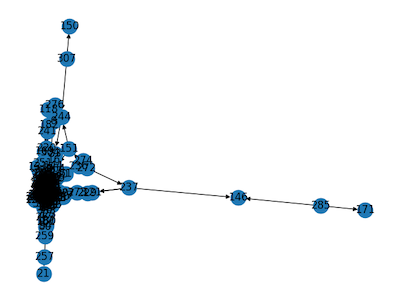
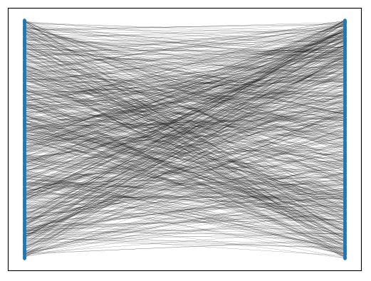

# Contents

- [Disclaimers](#disclaimers)
- [Description](#description)
- [Dependencies and Installation](#dependencies-and-installation)
- [Deterministic SHA-256 Reversal](#deterministic-sha-256-reversal)
- [Probabilistic SHA-256 Reversal](#probabilistic-sha-256-reversal)
- [Deterministic MD5 Reversal](#deterministic-md5-reversal)
- [Future Work and Extensions](#future-work-and-extensions)
- [References and Resources](#references-and-resources)

# Disclaimers

The implementation of this code works in theory, but I do not claim that it breaks the security of any cryptographic hash functions. To reverse something like a 64-round SHA-256 algorithm, it's probably still infeasible.

# Description

This repository contains my attempts at pre-image attacks on SHA-256, or more in general, recovering the set of input bits X given known output bits Y and the relationship between X and Y, f(X) = Y.

The repository also provides a generalized way of implementing hash functions to symbolically "trace" all bits that flow through the function. The results are stored in a standardized way to a **dataset** directory, which can then be used by different techniques to recover the initial input bits to the hash function.

In the code, bits may often be referred to as **random variables (RVs)** and operations between bits like AND gates or INV (= inversion = NOT gates) may often be referred to as **factors**.

Some questions that this code tries to answer include...

- Given a SHA-256 hash, can one find the input used to generate the hash?
- Given a partially known hash input and constraints on the (unknown) hash output, can the unknown section of the hash input be recovered?
- Given a SHA-256 hash, can a single bit of the hash input be predicted with high accuracy?


# Dependencies and Installation

I recommend using [Anaconda](https://www.anaconda.com/) to create a Python environment, and then install the necessary libraries with `pip`.

Use Python 3.6 and install from `requirements.txt`:

```
conda create -n preimage python=3.6
conda activate preimage
pip install -r requirements.txt
```

Some of the solvers use fancy backends like [Gurobi](https://www.gurobi.com/) or [Cplex](https://www.ibm.com/analytics/cplex-optimizer). These will not be installed with the requirements. If you wish to install them, an academic license is usually avaialable for free.

For Cplex on Mac OS X, make sure to do:
```
export PYTHONPATH=/Applications/CPLEX_Studio1210/cplex/python/3.6/x86-64_osx
```

# Deterministic SHA-256 Reversal

## Explanation

The idea here is to build the entire SHA-256 function symbolically, set constraints on the input and output of the hash function, and then feed this problem to a satisfiability (SAT) solver. It turns out that this approach has already been extensively researched for breaking cryptographic hash functions [1], [2], [3].

Instead of the hash input being a bit stream, it is a _variable_ of fixed length. Some of the bits in the input may be known and other unknown. For example, in BitCoin, the first 608 bits of a block are known and the remaining 32 bits (the nonce) are unknown. The block is fed to SHA-256 twice, and the resulting hash should be less than some pre-defined value (the "[difficulty](https://en.bitcoin.it/wiki/Difficulty)"). From this we can form constraints on our problem: only the 32-bit nonce is an unknown input variable, and the output is constrained to have a certain number of zeros in the least-significant bits (LSB).

The SAT solver I chose is the [z3 Theorem Prover](https://github.com/Z3Prover/z3) from Microsoft Research. I used the [BitVec](https://z3prover.github.io/api/html/classz3py_1_1_bit_vec_ref.html) primitive from this library, which represents a bit stream symbolically.

The problem can be formulated as follows:

```
# Instantiate the solver
solver = Solver()

# Create a fixed BitVecVal for the KNOWN beginning of the block
prefix = BitVecVal(block_header_no_nonce, 608)

# Create a BitVec for the nonce, whose bits are UNKNOWN
nonce = BitVec('nonce', 32)

# Hash input is formed by concatenating the prefix with the nonce
input_message = Concat(prefix, nonce)

# Run the input through SHA-256 to get a SYMBOLIC BitVec hash
digest = sha256.hash(input_message)

# Run through SHA-256 a second time
second_digest = sha256.hash(digest)

# Create a variable for the hash output, which is UNKNOWN
hash_guess = BitVec('hash_guess', 256)

# Add solver constraint that this variable must equal the digest
solver.add(hash_guess == second_digest)

# Now add a constraint to the solver that the beginning
# of the hash must have some number of zeros, e.g. 64
hash_beginning = Extract(63, 0, hash_guess)
solver.add(hash_beginning == 0)

# Check if the problem has a solution, and print it
if solver.check() == sat:
  print(solver.model())
```

For a great explanation of how SAT solvers work, I recommend [1].

## A note on endianness and z3

Keeping track of [endianness](https://en.wikipedia.org/wiki/Endianness) with respect to the z3 `BitVec` can be confusing at times, but it is absolutely critical for a functioning algorithm.

Let's say we have the binary number `0b1101 = 13`. I just expressed this number in Big Endian. We put the number into a variable: `b = BitVecVal(0b1101, 4)`.

Now I want to extract the 2nd LSB, the 0. I use z3's `Extract(upper_index, lower_index, bit_vec)` function. Note that these indices are _inclusive_. To retrieve the bit, I would use `Extract(1, 1, b)`.

It sounds simple, but it can often be confusing when working with indices and different endianness.

## How to run

The code for this section is in the `sha256` directory. You can run tests with `python test.py`. Be prepared to wait _at least_ until the death of the Sun for the tests to finish :)

For more reasonable tests you may adjust test parameters. For example: reduce the number of bits in the hash input message, reduce the required number of leading zeros in the hash, run the input through SHA-256 once (not twice), or even add a hash as a solver constraint and verify that the correct input message used to generate the hash is returned.

The tests are currently configured to predict the 32-bit nonce for the [Genesis block](https://en.bitcoin.it/wiki/Genesis_block) of BitCoin, given the other 608 bits. This requires 64 zeros in the hash and two passes through SHA-256, which is not the easiest of problems for a SAT solver...

# Probabilistic SHA-256 Reversal

## Dataset

The probabilistic approaches require a dataset. I formed a dataset by generating random 64-bit messages, feeding them to SHA-256, and writing the output to a CSV file. In real life, a message is usually much larger than 64 bits, but this is just for proof-of-concept.

Each line in the CSV file consists of 256 + 64 = 320 values, each 0 or 1. The first 256 entries are the SHA-256 hash and the remaining 64 are the hash input.

The script to create a dataset is [`generate_dataset.py`](./ml/generate_dataset.py).

## Neural network (NN)

Neural networks boil down to complex function approximators. So maybe it is reasonable that we can approximate `reverse(SHA256(message))` with a neural network.

See [`train_ml.py`](./ml/train_ml.py) for my attempt at doing this with TensorFlow. The NN attempts to predict a single bit of the input message, given all bits of the SHA-256 hash.

In short, it doesn't work--at least not with the simple network architectures I tried out. Test accuracy and loss don't budge, they are constant.

p.s. neural networks like this one are technically **deterministic**, not probabilistic, I know :)

## Bayesian network (BN)

The NN approach was doomed to fail in my opinion. It would require an enormously complex model to even begin to approximate a SHA-256 reversal function.

I think the more interesting approach lies in exploiting [conditional probability distributions](https://en.wikipedia.org/wiki/Conditional_probability_distribution) (CPDs) between hash input and output bits. For example, what is the probability of the input message's first bit being 1, given that hash bits 5, 32, and 67 are 0?

For a perfect hash function, the probability of any hash bit being 1 or 0 should be completely independent from other hash bits and from the input message. However this is real life, and I think it's reasonable to assume that there exist _extremely small_ conditional dependencies between bits. The question is, how to exploit them?

To attempt to exploit CPDs, I built a [Bayesian network](https://en.wikipedia.org/wiki/Bayesian_network) from the dataset, converted it to a [factor graph](https://en.wikipedia.org/wiki/Factor_graph), performed loopy belief propagation [4], and used the converged message values for inference.

#### Creating the undirected BN

A Bayesian network models conditional dependencies between random variables (RVs). In our case, there are 256 binary RVs for the hash bits, and 64 binary RVs for the input message bits. The BN should prefer to create edges between RVs which have a stronger conditional dependence rather than those which are conditionally independent.

We can get an idea of the conditional dependence between two RVs using their [mutual information score](https://en.wikipedia.org/wiki/Mutual_information). The first step is to calculate the mutual information score between all pairs of our RVs. We can skip the mutual information scores between input message RVs because we already know that we've generated them randomly and independently.

In the undirected graph, each RV is a node. We make an edge between every possible pair of nodes (except if two nodes are both input message RVs). The weight of an edge is the mutual information score between the two RVs which it connects.

Then the graph is pruned, because having too many edges leads to divergence of loopy belief propagation and also rare events (see [Future Work and Extensions](#future-work-and-extensions)). I prune the graph by removing the lowest-weighted edges from each node until it has no more than `max_connections` edges to other nodes. This `max_connections` is a hyperparameter, but setting it too high will cause the issues that I mentioned earlier.

**Note**: The method I have described for generating the graph's structure is a heuristic, and there may be better ways out there (for example, the [Bayesian information criterion](Bayesian_information_criterion)). In general, to consider all possible graph architectures is an exponentially hard problem.

#### Assigning directions to the BN

Now we want to assign directions to the undirected graph. This will help us answer the question, "Is A conditionally dependent on B, or is B conditionally dependent on A"?

If there exists a directed edge from A to B, it means that B is conditionally dependent on A.

Note that we do not want the hash input RVs to be conditionally dependent on anything, so no arrows should point to them. To assign edges, I use a breadth-first search starting from all hash input bits (these nodes are "first in line" for the BFS). Since none of them are connected to each other, no arrows will point _towards_ a hash input bit.

Below is a visualization of the directed graph. It's quite messy.



#### Creating a factor graph

The next step is to build a factor graph, which is a bipartite graph. One side of the graph has all of the random variables as nodes, and the other side has all of the "factors" as node. Each factor represents a conditional probability distribution and has a "query" RV as well as a list of "dependency" RVs.

For example, a factor `f` may represent `P(rv1 | rv5, rv10, rv21)`, i.e. the probability of observing `RV 1 = 0` or `RV 1 = 1`, given that we know the values of `RV 5`, `RV 10`, and `RV 21`.

A factor is created for each node in the directed graph. The "query" RV is the node itself, and the list of dependencies are all nodes which have an outgoing arrow to the query node.

Below is a visualization of the factor graph:



Each factor has a table which contains the probability of the query, given all possible values of the dependencies. If there are N dependencies in a factor, the table size is 2^N, so you can see how it is beneficial to keep the size of each factor low.

Let's take an example. Factor `f` has query `hash_bit_5` and dependencies `[input_message_bit_13, input_message_bit_21]`. It represents the CPD `P(hash_bit_5 | input_message_bit_13, input_message_bit_21)`.

Our factor `f` would have a table such as:


| `bit_13`        | `bit_21`        | `P(hash_bit_5 = 1 ｜  bit_13, bit_21)` |
| --------------- | --------------- | ------------------------------------ |
| 0             | 0             | `P(1 ｜ 0, 0) = ?`                    |
| 0             | 1             | `P(1 ｜ 0, 1) = ?`                    |
| 1             | 0             | `P(1 ｜ 1, 0) = ?`                    |
| 1             | 1             | `P(1 ｜ 1, 1) = ?`                    |


**Note**: It's not necessary to compute `P(hash_bit_5 = 0 | bit_13, bit_21)` because it can be derived by `1.0 - P(hash_bit_5 = 1 | bit_13, bit_21)`.


Let's say we want to calculate a CPD. How would we calculate, for example, `P(hash_bit_5 = 1 | input_message_bit_13 = 0, input_message_bit_21 = 1)`?

It's simple actually: go through each item in the dataset. Count how many items have `hash_bit_5 = 1 AND input_message_bit_13 = 0 AND input_message_bit_21 = 1`. Let's call this value **x**.

Now count how many items have `input_message_bit_13 = 0 AND input_message_bit_21 = 1`. Let's call this value **y**.

The CPD we want can be approximated with **x / y**.

Hopefully you can see that as the number of variables in the CPD increases, the chance that our dataset contains an entry where all variables are assigned the values we want will decrease. This would be called a "rare event."

#### Loopy belief propagation (LBP)

LBP is an iterative "message passing" algorithm in which messages are passed between factors and RVs in the factor graph. We say the algorithm has _converged_ when none of the messages change by more than some small value ε.

Once the messages have converged, we can use them to perform queries on the factor graph, for example to answer the question "What is the probability that the input message bit 0 is a 1, given that I know all of the hash bits?"

What exactly is a "message"? It's hard to explain, to be honest. It's quite mathematical, theoretical, and unintuitive. I recommend [4] for understanding LBP, but I won't go into detail here.

Alternatively, just look at the code: [`factor_graph.py`](./ml/graphs/factor_graph.py)

#### Inference

If the only unknown variable were the hash input bit we are trying to predict, our lives would be easy. We could use the method described in [Creating a factor graph](#creating-a-factor-graph) to get the probability `P(input message bit | all other input message bits and hash bits)`.

However, we don't know the values of all other hash input bits, which is why we have to go to the trouble of LBP.

Let's say we want to know the probability of an input message bit being 1, given values (0 or 1) for all hash bits. Let's call our input message bit B.

First find all factors who reference B, either as their query RV or in their dependency RVs. Multiply together the message from each of these factors to B when **B=1** and store the product in X. Now multiply together the message from each factor to B when **B=0** and store the product in Y.

The probability of B=1 given all of the hash bits is then X / (X + Y).

Note that each time the hash changes, the values of the "observed" RVs change, so loopy belief propagation must be re-run. Additionally, there are no guarantees of convergence with LBP, especially the more loops in the graph.

#### Result

The best prediction accuracy I could achieve was around 50.3%. Although this may be statistically significant given 20,000 samples, it is not useful. For example, with a 64-bit message and 99% prediction accuracy per bit, the chances of predicting the entire message correctly are 0.99^64 = 52.6%. As accuracy drops to 50%, the probability of guessing the entire input message becomes basically zero.

The idea for this "attack" came after taking the course [Probabilistic Artificial Intelligence](https://las.inf.ethz.ch/pai-f19) at ETH Zürich.

## How to run

The code for this section is in the `ml` directory. You can run everything with `python main.py`, but make sure you've generated the dataset first.

# Deterministic MD5 Reversal

## Explanation

Before trying to break SHA-256 with a SAT solver, I wanted to test out the approach on the "already broken" MD5 hash function. Basically everything I've written in [Deterministic SHA-256 Reversal](#deterministic-sha-256-reversal) also applies here.

The regular MD5 implementation comes from [5].

## How to run

The code for this section is in the `md5` directory. You can run tests with `python test.py`.

# Future Work and Extensions

- **Using internal states of the SHA-256 algorithm**: add solver constraints from the internal state, or for the probabilistic approach, add random variables for the internal state.
- **Using a more complex neural network model**: perhaps the neural network approach would work better with a larger, more complex model, however I haven't spent much time on this area because I don't believe it would work.
- **Finding the truly optimal BN structure is a NP-hard problem**. The current structure is just a heuristic I came up with, but there are probably better ways out there. Note that creating a maximum spanning tree (e.g. with [Kruskal's algorithm](https://en.wikipedia.org/wiki/Kruskal%27s_algorithm)) is not sufficient, because it implies that hash bits are conditionally dependent on only 1 other hash bit or input message bit. Clearly this is not true: each hash bit is dependent on many (if not all) input message bits.
- **Handling rare events**: there may be cases where the probabilistic algorithm needs to know the conditional probability of a rare event. For example, `P(hash0=b0 | hash1=b1, hash2=b2, ..., hashN=bN)`. Here `hashi` is a random variable for the i-th hash bit, and `bi` is a bit value, 0 or 1. The probability of a single entry in the dataset having this combination of bits is approximately `2^(-N)`. Having a large dataset is good, because it increases your odds of having an instance of a rare event like this. But it's not always possible, in which case I use 0.5 as the probability (implicitly assuming conditional independence).

# References and Resources

- [1] [SAT-based preimage attacks on SHA-1, Masters Thesis of Vegard Nossum](https://www.duo.uio.no/bitstream/handle/10852/34912/thesis-output.pdf?sequence=1&isAllowed=y)

- [2] [Explanation on using SAT solver with BitCoin](http://jheusser.github.io/2013/02/03/satcoin.html)

- [3] [SAT Solvers for Cryptanalysis](https://www.microsoft.com/en-us/research/publication/applications-of-sat-solvers-to-cryptanalysis-of-hash-functions/)

- [4] [Loopy Belief Propagation Explanation](http://nghiaho.com/?page_id=1366)

- [5] [md5 Implementation](https://github.com/narkkil/md5)

